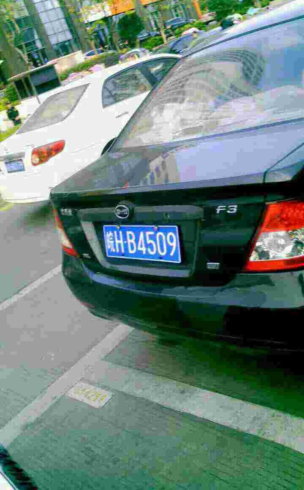
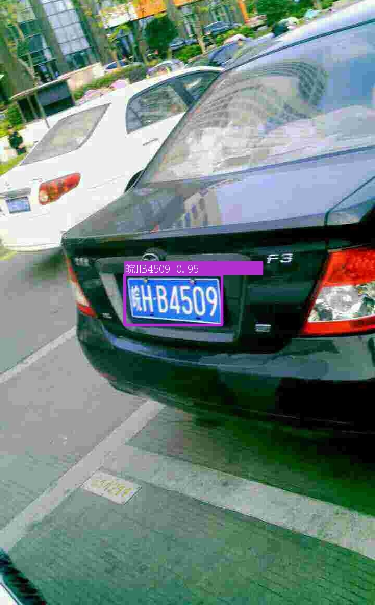

# LPD-Project

车牌 YOLOv5 检测与 LPRNet 识别项目，基于 PaddlePaddle 深度学习框架实现。

<table>
<tr>
   <td></td>
   <td></td>
</tr>
</table>

## 项目简介

在车牌检测任务中，最简单的流程就是车牌检测+车牌识别两个步骤，但当镜头没有正对车牌的时候，图片中的车牌会有透视变形，增加识别任务的难度。

针对拍摄角度引起的透视变形，可再增加一步车牌校正的流程，整个任务流为：车牌检测、车牌校正、车牌识别


对于车牌检测部分，使用常用的检测算法yolo，可以输出目标的检测框和分类概率，但检测框还不能简化校正工作，若能识别出车牌的4个角点就能直接进行矫正了。

与yoloface一样，可在yolo框架中添加关键点回归分支，从而实现对车牌4个角点的检测


## 项目概述

本项目是一个车牌检测与识别系统，主要包含以下组件：
- YOLOv5-LPD-Keypoint：基于 YOLOv5 的车牌检测模型
- LPRNet-LPD-Keypoint：基于 LPRNet 的车牌识别模型

## 环境要求

- Python >= 3.9
- 》》》》 [uv](https://docs.astral.sh/uv/getting-started/installation/) 《《《《
- [WSL](https://learn.microsoft.com/zh-cn/windows/wsl/install)
- CUDA Toolkit
- cuDNN
- PaddlePaddle GPU 版本
- 其他依赖包（详见 pyproject.toml）

## 安装步骤

### 1. 克隆项目

```bash
git clone [项目地址]
cd LPD-project
```

### 2. 设置环境

请按照以下步骤设置环境：

1. 同步项目依赖：
```bash
uv sync
```

2. 设置 CUDA 库软链接：
```bash
sudo python3 setup-env.py
```

3. 设置 CUDA 库路径：
```bash
source setup-env.sh
```

4. 验证环境设置：
```bash
python check.py
```

详细的环境设置说明请参考 [setup-env.md](setup-env.md)。

### 3. Jupyter 环境设置（可选）

如果需要使用 Jupyter Notebook，请参考 [setup-jupyter.md](setup-jupyter.md) 进行设置。

### 4. OpenCV 中文字体设置

为了在 OpenCV 中正确显示中文字体，需要安装中文字体：

1. 下载中文字体：
```bash
git clone https://github.com/eric-gitta-moore/linux-fonts
cd linux-fonts
chmod +x ./install.sh
sudo ./install.sh
```

2. 确保系统中有 `simsun.ttc` 字体文件

3. 测试中文字体显示：
```bash
python YOLOv5-LPD-Keypoint/test.py
```

详细说明请参考 [font.md](font.md)。

### 5. 下载预训练模型

1. 从以下地址下载预训练模型：
   https://github.com/eric-gitta-moore/LPD-project/releases/tag/v0.0.1
   - LPRNet-LPD-Keypoint.zip
   - YOLOv5-LPD-Keypoint.zip

2. 将下载的压缩包中的 `runs` 目录复制到对应的模型目录下

详细说明请参考 [pretrained.md](pretrained.md)。

## 项目结构

```
LPD-project/
├── YOLOv5-LPD-Keypoint/    # 车牌检测模型
│   ├── demo/               # 演示示例
│   │   └── demo3.jpg      # 车牌检测演示图片
│   └── test.py            # 测试脚本
├── LPRNet-LPD-Keypoint/    # 车牌识别模型
├── assets/                 # 资源文件
├── setup-env.sh           # 环境设置脚本
├── setup-env.py           # CUDA 库设置脚本
├── pyproject.toml         # 项目依赖配置
└── README.md              # 项目说明文档
```

## 使用说明

1. 确保环境已正确设置
2. 运行主程序：
```bash
python main.py
```

3. 查看演示效果：
   - 在 `YOLOv5-LPD-Keypoint/demo` 目录下提供了车牌检测的演示图片

## 注意事项

- 确保使用 root 权限运行 setup-env.py
- 每次开启新的终端会话时，都需要重新运行 `setup-env.sh`
- 如果使用不同的 Python 环境，可能需要调整脚本中的路径
- WSL 用户需要确保 WSL 已正确配置 CUDA 支持
- 使用 OpenCV 显示中文时，需要确保已正确安装中文字体

## 数据集
- [CCPD PDRC 中科大-车牌数据集](https://aistudio.baidu.com/datasetdetail/17968)

## 参考
> 实在跑不动建议直接 copy 下面两个项目在 飞桨 AI Studio 里面不用配置任何环境，直接跑

- [YOLOv5车牌+关键点检测](https://aistudio.baidu.com/projectdetail/6545272)
- [车牌识别LPRNet](https://aistudio.baidu.com/projectdetail/5628649)
